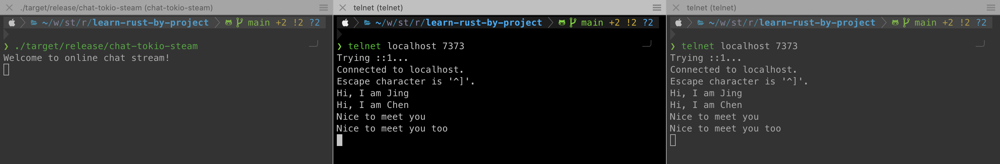

# Introduction

A set of rust project for learning purpose.


# Project & RoadMap

### Snake: a simple snake game

- Simple snake game with basic functionality. 2022 Oct
- Add Game info like score, speed 2023

### Chat-tokio: chat app based on tokio
- Chat-tokio-steam basic functionality Oct 2022


# Compile & Run

## Compile
```shell
> cargo build --release
```

## Run
### Snake

```shell
> ./target/release/snake
```
### chat-tokio-steam

#### start server
```shell
> ./target/release/chat-tokio-steam
Welcome to online chat stream!
```
#### start client

start client in a new terminal (support multiple client)
```shell
> telnet localhost 7373
```



